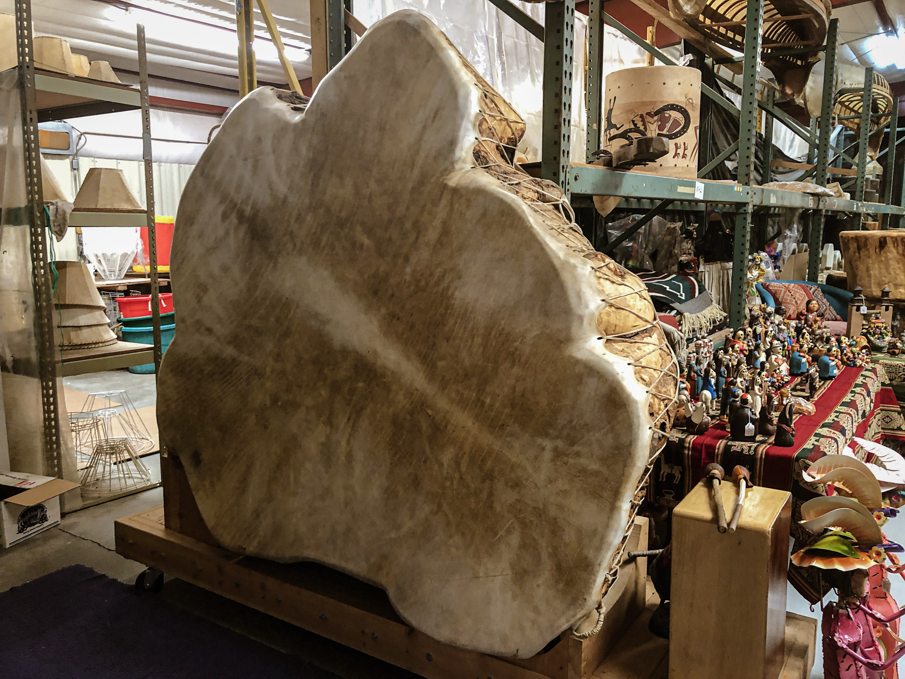
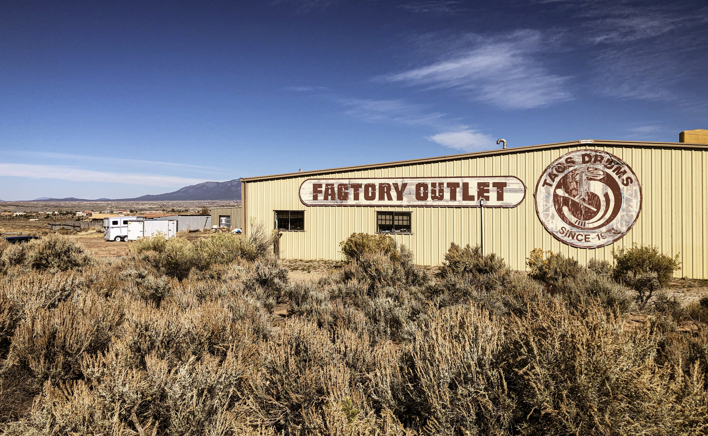
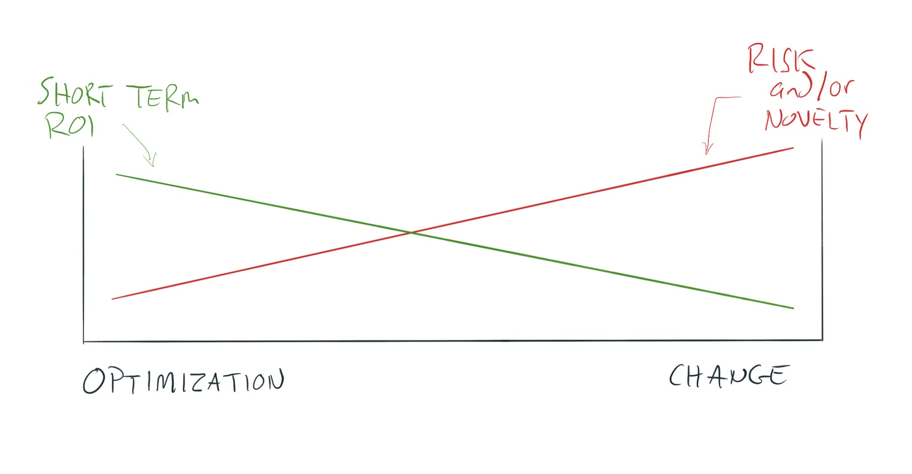
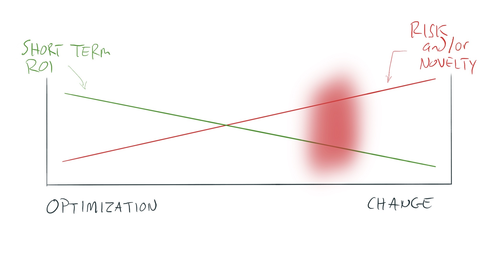
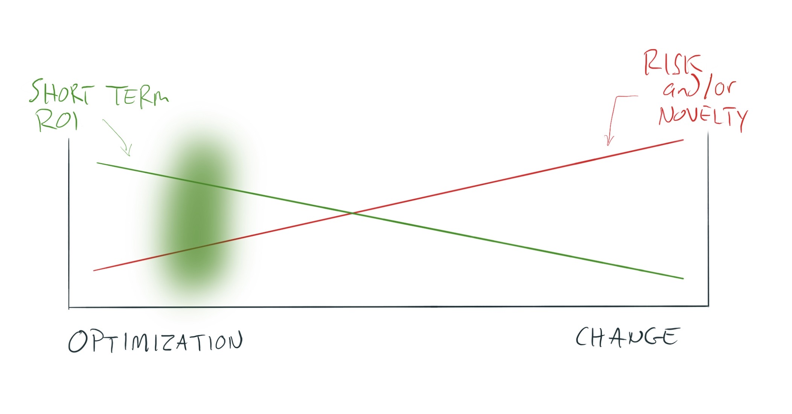

# This is a drum

{width=100%}

`r library(tufte); newthought("The clerk at the store said")` in 1983 Mick Fleetwood bought it, and then never returned to pick it up. It's been sitting there the whole time.

I have no reason to disbelieve this.

I mean, if it's 1983 and you're Mick Fleetwood, why _woudn't_ you  buy a massive cottonwood and cowhide drum in Taos and forget to pick it up, or just never bother to pick it up. After all, it's 1983 and you're Mick freaking Fleetwood! You're busy being famous. And Taos is quite a ways from LA.

`r newthought("I spent a large part of the weekend")` reading and refreshing and reading the KincadeFire Twitter hastag.

It's painful to see a place I lived, and people I know, be so threatened by a wildfire. Even if you live one county or more away from the actual fire, you still _feel_ a sense of danger. I felt the danger from over 1,000 miles away!

Part of that feeling, for me at least, comes from knowing 6 people whose houses burned down in the 2017 Tubbs fire. It makes events like this one personal.

The 2018 Camp fire was, in some ways, worse. 

If you deal with complexity in any way, reading the excellent Wikipedia article on the Camp fire is worth the time: [https://en.wikipedia.org/wiki/Camp\_Fire\_(2018)](https://en.wikipedia.org/wiki/Camp_Fire_(2018)) BTW, that was a trick setup there. It's 2019. We _all_ deal with complexity. :)

And quite possibly, we help our clients deal with complexity.

`r newthought("The Camp fire, and other large scale wildfires")`, are incredible case studies in complexity and risk and decision making. This is just a partial list of the components of the complex system of a wildfire:

- People
	- Government
	- Private companies
	- Volunteers
	- Citizens
- Policy
	- Land use policy
	- Contracts
	- Overall policy direction and high-level usage of resources, development regulation, etc.
- Infrastructure
	- Electrical transmission and distribution
	- Transportation infrastructure: roads, airports, etc.
	- Water pumping and delivery infrastructure
	- Information distribution
		- Internet, SMS, terrestrial radio
		- Private/public platforms like Twitter, Facebook, etc.
		- Information assets from governments (ex: Cal Fire's website), etc.
- Resources
	- Money
	- General equipment (bulldozers, etc.)
	- Specialized fire fighting equipment
	- Prison labor
	- Professional fire fighters
	- Information
		- Mostly accurate information
		- Mostly inaccurate information
		- Authority of various information sources, like the phenomenal Sarah Stierich ([https://www.sarahstierch.com](https://www.sarahstierch.com) and [https://twitter.com/sarah\_stierch](https://twitter.com/sarah_stierch)), a freelance specialist wildfire reporter
		- Specialized data like weather forecasts, satellite imagery, etc.
- Decision making
	- Information availability
	- Biases (the following decision making biases are likely to come into play before and during a wildfire: Ambiguity effect, Anchoring, Attentional bias, Attribution substitution, Availability heuristic, Availability cascade, Backfire effect, Bandwagon effect, Belief bias, Confirmation bias, Conservatism bias, Dunning-Kruger effect, Illusion of control, Illusion of validity, Loss aversion, Normalcy bias, Observer-expectancy effect, Optimism bias, Ostrich effect, Overconfidence effect, Planning fallacy, Present bias, Pro-innovation bias, Risk compensation, Salience bias, Selection bias, Subadditivity effect, Parkinson's law of triviality, Zero-risk bias)
	- Unknown or poorly defined probabilities
	- Jurisdictional relationships, lines of communication, trust, etc.

`r newthought("It's tempting to over-simplify this complexity.")` Some meme drumbeats that have been going on for a while will get amplified during the 2019 wildfire season:

- Fucking PG&E. They're a greedy, incompetent, private company. This wouldn't happen if they were a public utility. Or if they'd buried their lines. Or, or, or...
- Fucking climate change. This wouldn't happen if federal level politicians weren't so greedy or shortsighted or so [insert simple, easy to hate attribute here].
- Fucking land use policies. Wildfires would happen but wouldn't be so bad if land use policies made it harder/more expensive/impossible for people to live in wooded rural areas.

There are probably others, but those are the memes I've seen circulating, and saw amplified over the weekend in the context of the Kincade fire.

None of these are totally untrue, except that by focusing on one simple easy aspect of a complex system, they _are_ untrue.

Think PG&E is the problem? How would _you_ deliver reliable, cost-competitive electrical power to 16 million people spread out over 70,000 square miles of terrain ranging from desert, heavily wooded rural areas, densely populated urban areas, mountainous areas, areas with lots of laws regulating construction, areas that don't give a fuck what you do, to areas that experience wildly varying weather. That's just the distribution side of things. You'd also be managing 174 hydroelectric dams, 1 nuke, 3 or so natural gas plants, some solar plants, and an assortment of other generation resources. And, to meet future demand, you'd be trying to build _more_ of these important resources that are absolute magnets for NIMBYism and bad PR. And you'd be constantly negotiating rates and contracts with a bunch of other utilities to source 33% of your power needs against demand that is partially predictable and partially unpredictable. And no matter how well you managed your sourcing, generation, and distribution infrastructure, you'd be fighting a war on four additional fronts: regulatory, customer service, public relations, and legal. Each of these is just as complex as the sourcing, generation, and distribution part of things.

PG&E, fighting its 7-front war, is just one complex system within a larger complex system that we can see in action before and during a wildfire.

`r newthought("In consulting, I see two basic categories: change and optimization.")`

Let's set aside for a moment that optimization _is_ a form of change. When I say "change consulting", I mean supporting clients who want to do something _fundamentally new_ or different. Optimization consulting is helping them improve something they're already doing.

The wildfire system in California has optimized since 2017. 

At least from my comfortable vantage point in Taos and through the lens of Twitter and some text messages with friends in Sonoma County, I see improvement. Evacuations, for one example, are more proactive, which frees fire fighting resources up to focus on fighting the fire and saving infrastructure rather than saving lives _and_ trying to save infrastructure.

The drumbeat memes you'll see amplified during and after this wildfire season aren't asking for optimization consulting. The impulse underneath these memes is: we need _change_ (and we need it _yesterday_).

Change is a lot harder and more expensive than optimization, at least in the short run. Over the long run, avoiding change can lead to significant expense or death. But in the short run, optimization is cheaper.

`r newthought("My clients who practice change consulting")` feel this in every aspect of their business, which I also view as a complex system.

Business development is harder and different.

Marketing is more loosely coupled with business success, and requires investing in more slow-acting ways.

Service offerings are generally more weird and harder to define.

Change is more expensive than optimization.

If you can find clients who understand this, you can make a lot of money helping them with this change/transformation.

I suspect Mick Fleetwood was seeking change on an optimization budget when he bought that giant drum in 1983 at this shop:

{width=100%}

It's one thing to be the namesake founding drummer of a famous band and add one more drum to your collection. Especially if that drum is small and portable. That's an easy optimization.

It's a whole other thing if that drum is a 6-foot wide hollowed out tree trunk that's been covered with like two whole cow hides. That's not an optimization. That's a serious project to deal with. That's disruption. That's change.

The "change on an optimization budget problem" might be why Mick Fleetwood's drum is still sitting in this shop 26 years later!

## Warning: over-simplified model of the world ahead.

Let's keep exploring this change vs. optimization consulting idea.

Here's one way to model this:

{width=100%}

You've got activities that are change-ey, that involve lots of risk, novelty, or both.

And you've got activities that are optimize-ey, that involve less risk and/or novelty, and feature a better short term ROI.

The "-ey" suffix is cute, but henceforth I'll just stick with "change consulting" and "optimization consulting".

## Risk & uncertainty

Let's say you're a solo operator. You land a huge project, have always wanted to build an agency, and so you decide to leverage this opportunity and go for it. You're gonna staff up.

Here's roughly where you sit:

{width=100%}

You're trying something that's novel for you. You'll have to learn new behaviors. You'll have to plan differently. You'll have to feed more mouths. You might have to take on work you find distasteful or boring. This is change.

In my model, I say change consulting involves more novelty _and/or_ more risk.

`r newthought("That's a critical distinction.")`

How risky is this agency-building project in reality? 

It certainly involves uncertainty for you. But uncertainty is not identical to risk. ^[Uncertainty is not identical to risk. And sometimes, doing something new (which is the source of the uncertainty) is _less_ risky than continuing to do the same known thing. So again, novelty/uncertainty are not identical to risk. Sometimes they're not even correlated to risk. And increased novelty/uncertainty doesn't cause increased risk.](

If you go to a truly excellent restaurant, and when the server asks what you want you say "Surprise me!" (and you genuinely mean it), you're not taking a risk. You're inviting uncertainty, but the risk that your meal is bad is quite low. You just don't know which tasty meal you're going to get. That's uncertainty, not risk.

`r newthought("Back to our agency example: let's say this is the first time you've ever landed a project that could keep a small team busy")`, and furthermore you have no idea how you might even try to repeat getting this kind of client. The agency-sized client was pure luck for you. Furthermore, you have 2 months of runway when you decide you want to agency up.  _That's both novelty **and** risk made into one nasty-tasting, stress-filled sandwich_. 

So on the change end of our spectrum, you may be accepting more novelty, more risk, or both more novelty and more risk.

## The CRO consultant

Moving to the opposite end of the spectrum: let's say you have an e-commerce business. Sales are good. You have a 7-year track record of good sales on your site. Amazon has not eaten your lunch because you have a differentiated product, customers like it, and you have solid business fundamentals.

You hire a conversion rate consultant.

They're playing here:

{width=100%}

Their work looks much more like optimization consulting.

Yes, they might propose some new stuff. In fact, they can't do their work at all if they aren't allowed to change _some_ things.

But their work involves so much less risk and novelty than what I'd define as change consulting. In fact, the CRO consultant's work is likely to produce strong ROI with little risk of screwing things up. After all, they aren't changing your business model one bit. They're just trying to squeeze more profit out of it, which is a noble venture.

## Patio11

Some of you have read Patrick McKenzie describing getting paid \~$20 to 30k/week consulting rates for doing what he has described as a "dramatic reading of some blog posts". (source: see first two results of <https://www.google.com/search?q=site:www.kalzumeus.com+dramatic+reading&ie=UTF-8&oe=UTF-8&hl=en-us&client=safari>)

Patrick is describing optimization consulting. Moreover, he's describing optimization consulting _at a certain very lucrative point in the pre-maturity of a particularly profitable business ecosystem_. In other words, he's describing optimization consulting for very young, mid-sized, high-profit SaaS businesses. 

In essence, he's telling people with an incredibly productive apple orchard who've never heard of a ladder that -- not only can they pick up the bounty of apples that fell to the ground -- they can _also_ use this thing called a ladder to pick even more perfect fruit from their incredibly productive apple orchard.

`r newthought("This telling-orchard-owners-about-ladders work is good stuff.")` It's low risk, high ROI. That's an attractive combination. 

It may be easy to sell, but not necessarily. That depends on what size client you're selling to, their urgency of need, and other factors.

It does have some structural problems though.

Guess where the competition flocks once you write a few blog posts crowing about getting paid $30k/week to do dramatic blog post readings to clients?

You might at that point have a first-mover advantage, but you better also have a sustainable differentiator as well if you want to keep those kinds of consulting projects coming in.

`r newthought("The other structural problem is that there's not an unlimited supply of low-risk/high-ROI optimizations out there.")` These are the very definition of low-hanging fruit, which gets picked first.

Far fewer competitors have what it takes to operate in the "red zone": ^[I should probably change the colors in my illustration in the next revision. If what's currently the "red zone" were blue it would line up nicely with the ideas in "Blue Ocean Strategy" including the color associated with new opportunity.]

{width=100%}

Why?

Because it's really hard to navigate risky change.

Clients get excited about the idea of digital transformation, but how many have what it takes to really transform that way?

Consultants like to facilitate impactful change, but how many really have what it takes to support and/or lead that kind of change?

If you're facilitating genuine change for clients, you're unlikely to have much competition, especially if you focus on larger companies. ^[There are interesting areas where those facilitating change _do_ have a lot of competition, even when focused on small companies. A good example is those helping actual startups, which often tend to be small. There's just something inherently sexy about this problem, and it draws folks to it, creating lots of competition to work with startups.]

## You

Should you be practicing change or optimization consulting?

I haven't (yet) used my scrappy research tools to look outside the pool of my clients, which is composed primarily of folks bootstrapping a consulting business and early stage change consultants. I don't know, for example, what percentage of all consultants are change vs. optimization consultants. So as I reflect on the above question, I'm working from a biased sample. And I myself am biased towards change consulting. That's essentially the kind of consulting I practice.

`r newthought("Repeating the question for convenience: Should you be practicing change or optimization consulting?")`

In my experience, you won't have much choice at the outset. Unless you have an exceptionally high risk profile, you'll need every advantage you can marshall as you bootstrap your business.

That means you'll use whatever head start you have, and that head start will define what kind of consulting you practice.

Over time of course you can migrate from optimization to change consulting.

But I can't think of one change consulting client of mine who would willingly migrate to optimization consulting. Something about their wiring seems to preclude this.

I get it! Despite the greater ease of optimization consulting (easier marketing, lower risk, higher chance of strong ROI), the change consultants seem happy to wrestle with the greater difficulty inherent in their path (more difficult marketing, higher risk, "weirder" service offerings, and delayed ROI for clients).

And I'm happy to support them/you in this growth.

-P

